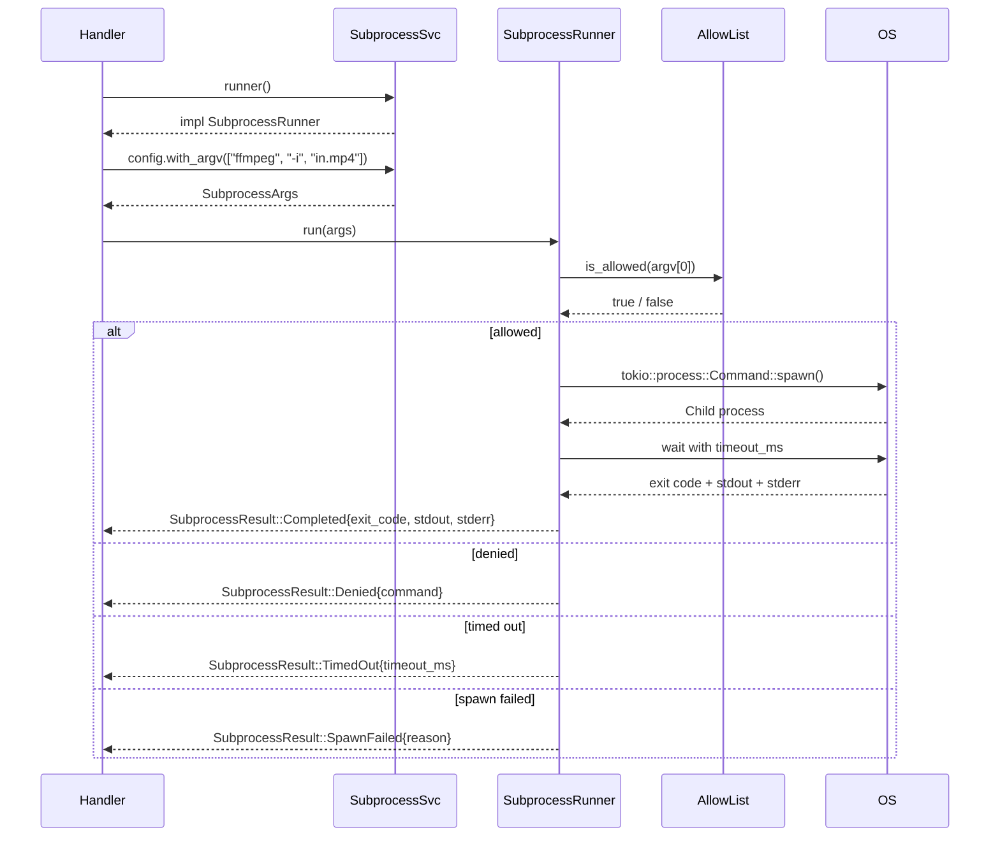
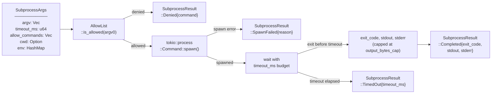

# Architecture — edge-egress-subprocess

## Sequence

> A handler builds `SubprocessArgs`, submits them to `SubprocessRunner`; the runner checks the allowlist, enforces the timeout, spawns the process, and returns an exhaustive result.

## Data Flow

> `SubprocessArgs` (argv, timeout, allowlist) enters the runner; the exhaustive `SubprocessResult` exits — no hidden error paths.

